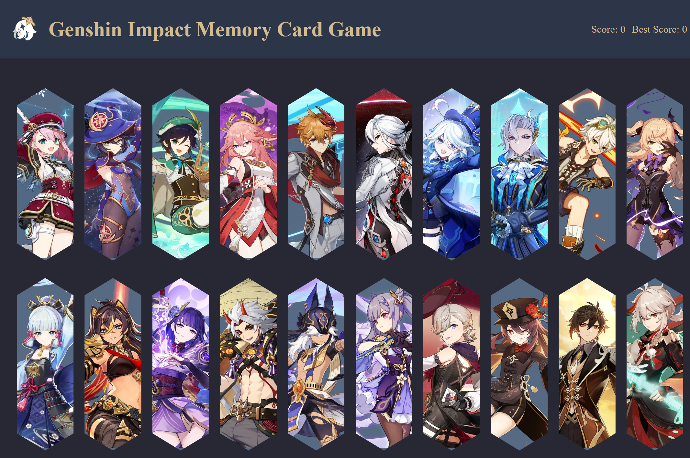

# memory-card


## Disclaimer

```
miHoYo does not prohibit non-commercial personal use. Addtionally, you understand and agree that the rights to all Genshin Impact MATERIALS (such as copyright, trademark, and other intellectual property rights) have not been transferred to you from miHoYo and its related obligees, nor should it be regarded as an approval in the legal sense (including implied approval). miHoYo reserves the right to exercise its rights (including but not limited to the derivative works produced and released based on Genshin Impact MATERIALS). At the same time, it is required to place the miHoYo legal declaration on such works, such as "© All rights reserved by miHoYo. Other properties belong to their respective owners."
``` 

**© All rights reserved by miHoYo. Other properties belong to their respective owners.**

## Demo


## Mobile


## Desktop and Laptop
